# Düşme ve Hareketsizlik Tespiti Platformu
 
Akıllı telefonu bir IoT uç cihazı olarak kullanarak, yaşlı bireyler ve yalnız yaşayan kişiler için **düşme şüphesi** ve **uzun süreli hareketsizlik** durumlarını gerçek zamanlı tespit eden mobil güvenlik platformu.

## Özellikler
 
-  **Mobil sensör toplama:** İvmeölçer, jiroskop ve GPS verileri 1 Hz örnekleme ile toplanır; her 3 saniyede bir zaman damgalı (ISO 8601) olarak sunucuya gönderilir.
-  **Kimlik doğrulama ve yetkilendirme:** JWT access (1 saat) + refresh token (7 gün, veritabanında saklanır), bcrypt şifre hashleme, `admin` / `user` rolleri ve rol tabanlı erişim kontrolü.
-  **Anomali tespiti:** Eşik tabanlı düşme tespiti (ivme büyüklüğü > 1.6g) ve zaman serisi tabanlı hareketsizlik analizi (30 sn penceresinde min-max farkı < 0.08g) + alarm tekrarını önleyen cooldown mekanizması.
-  **Gerçek zamanlı izleme:** JWT doğrulamalı Socket.io bağlantısı; `sensor:new` ve `alert:new` olayları yalnızca verinin sahibine ve admin kullanıcılara yayınlanır (oda bazlı yayın).
-  **Web paneli:** React + Recharts ile ivme büyüklüğünün canlı zaman serisi grafiği, cihaz listesi, alarm listesi ve alarm çözümleme; admin için tüm kullanıcıları kapsayan görünüm ve yeni admin oluşturma.
-  **PostgreSQL veri modeli:** UUID birincil anahtarlar, TIMESTAMPTZ zaman sütunları, CASCADE silme kuralları; gelecek özellikler için önceden tasarlanmış ek tablolar.
## Sistem Mimarisi
 
```
┌─────────────────┐   REST (JWT)    ┌──────────────────────┐        ┌──────────────┐
│  Mobil İstemci  │ ──────────────▶ │   Node.js Backend    │ ─────▶ │  PostgreSQL  │
│  (Expo / RN)    │                 │  Express + Socket.io │        │ (Neon Cloud) │
└─────────────────┘                 └──────────┬───────────┘        └──────────────┘
                                               │ Socket.io (JWT, oda bazlı)
                                    ┌──────────▼───────────┐
                                    │      Web Paneli      │
                                    │   React + Recharts   │
                                    └──────────────────────┘
```
 
Veri akışı: mobil uygulama sensör verisini gönderir → backend cihaz sahipliğini doğrular → veri `sensor_data` tablosuna yazılır → `anomaly.service.analyze()` çalışır → alarm oluşursa `alerts` tablosuna kaydedilir → `sensor:new` / `alert:new` olayları ilgili odalara yayınlanır → panel anlık güncellenir.
 
## Klasör Yapısı
 
```
.
├── backend/                  # Node.js + Express API
│   ├── server.js             # HTTP + Socket.io sunucu başlatma
│   └── src/
│       ├── app.js            # Express kurulumu, route bağlamaları, global hata yakalayıcı
│       ├── config/db.js      # PostgreSQL bağlantı havuzu (pg.Pool)
│       ├── middleware/       # auth (JWT), role, validate (express-validator)
│       └── modules/
│           ├── auth/         # Kayıt, giriş, refresh token
│           ├── devices/      # Cihaz oluşturma, listeleme, durum güncelleme
│           ├── sensorData/   # Sensör veri alımı + anomali servisi
│           ├── alerts/       # Alarm listeleme ve çözümleme
│           └── admin/        # Admin oluşturma (yalnızca admin)
├── database/
│   ├── schema.sql            # Sıfırdan kurulum şeması (10 tablo)
│   └── migration_timestamptz.sql
├── mobile/                   # React Native / Expo uygulaması
│   └── src/
│       ├── hooks/useSensors.ts      # İvmeölçer + jiroskop + GPS toplama
│       ├── screens/                 # Giriş, kayıt, ana ekran, alarmlar, profil
│       └── services/                # axios istemcisi (token interceptor) ve API servisleri
└── web-panel/                # React + Vite + Recharts izleme paneli
```
 
## Teknoloji Yığını
 
| Katman | Teknolojiler |
|---|---|
| Backend | Node.js, Express.js v5, Socket.io, jsonwebtoken, bcrypt, express-validator, dotenv |
| Veritabanı | PostgreSQL (Neon Cloud), pg (node-postgres) |
| Mobil | React Native / Expo SDK 53, expo-sensors, expo-location, expo-secure-store, axios |
| Web Paneli | React 18, Vite, Recharts, socket.io-client |

## 📱 Mobil Uygulama

| Giriş                                               | Kayıt                                              | Ana Sayfa                                            |
| --------------------------------------------------- | -------------------------------------------------- | ---------------------------------------------------- |
| 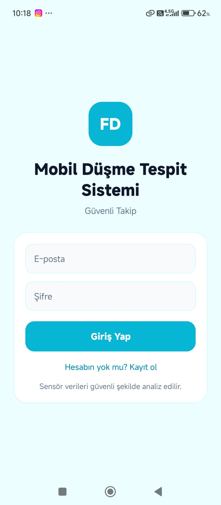 |  | 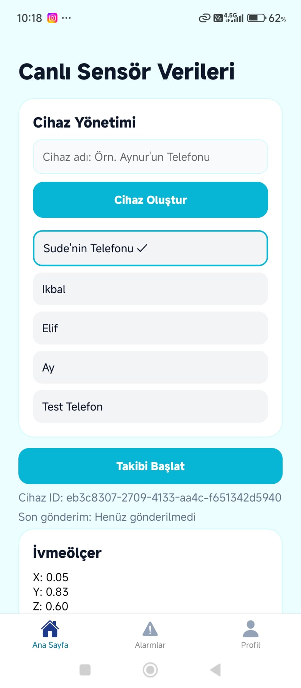 |

| Ana Sayfa 2                                          | Alarm Geçmişi                                   | Kullanıcı Profili                                          |
| ---------------------------------------------------- | ----------------------------------------------- | ---------------------------------------------------------- |
| 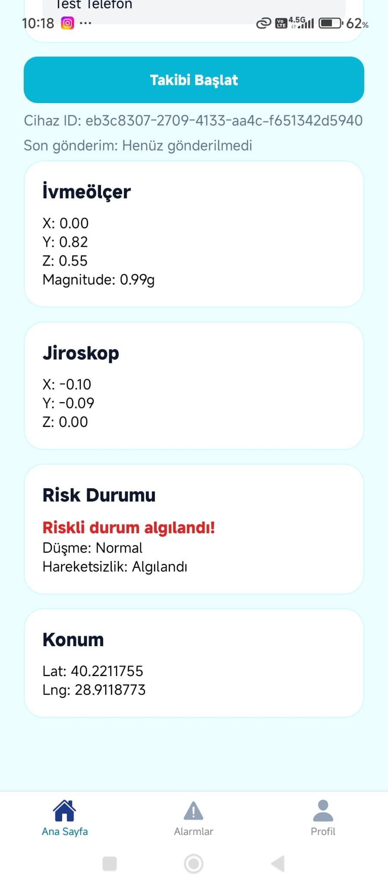 | 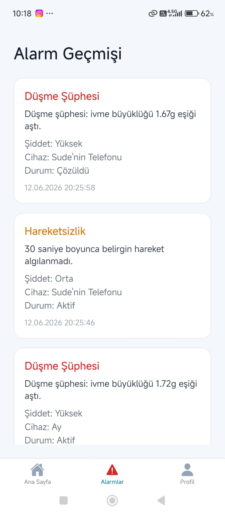 | 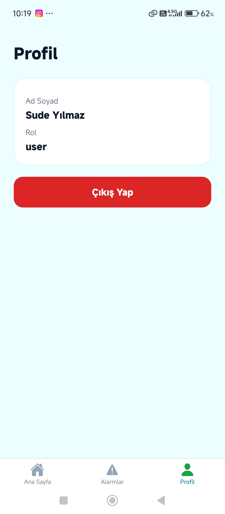 |

| Admin Profili                                          |
| ------------------------------------------------------ |
| 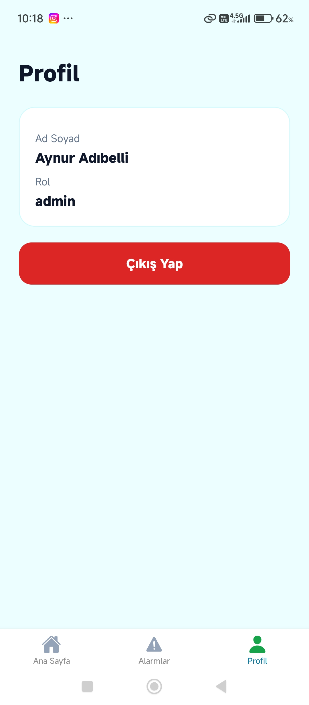 |

---

## 💻 Web Paneli

### Giriş Sayfası

<p align="center">
  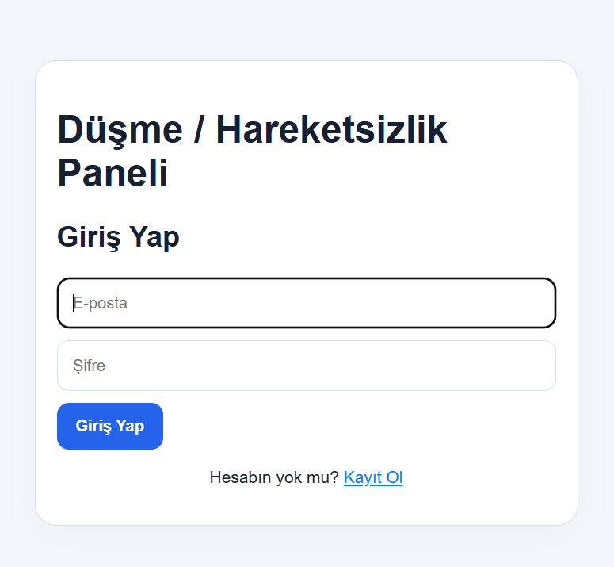
</p>

### Kayıt Sayfası

<p align="center">
  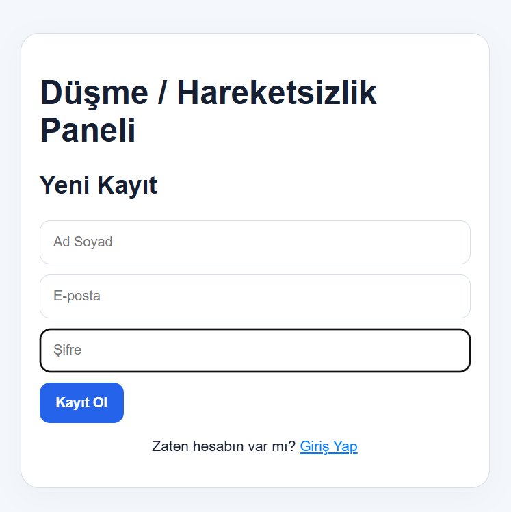
</p>

### Kullanıcı Paneli

<p align="center">
  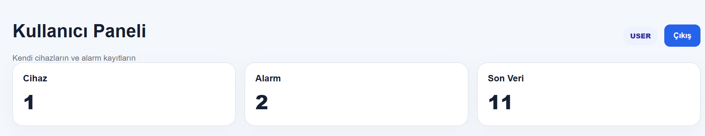
</p>

### Kullanıcı Veri Ekranı

<p align="center">
  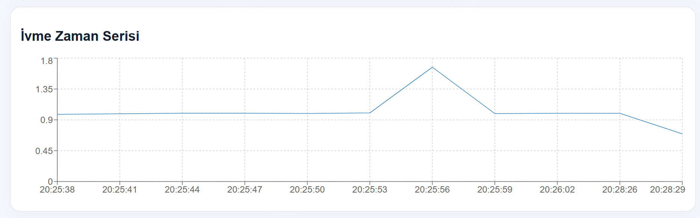
</p>

### Kullanıcı Alarm Ekranı

<p align="center">
  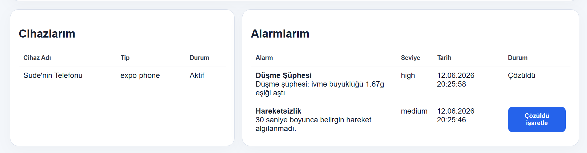
</p>

### Admin Paneli

<p align="center">
  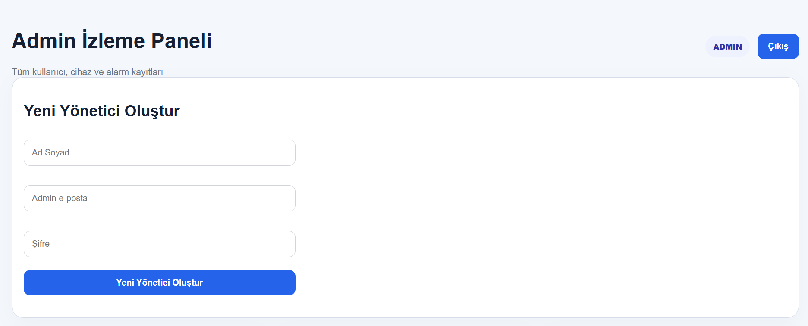
</p>

### Admin Alarm Ekranı

<p align="center">
  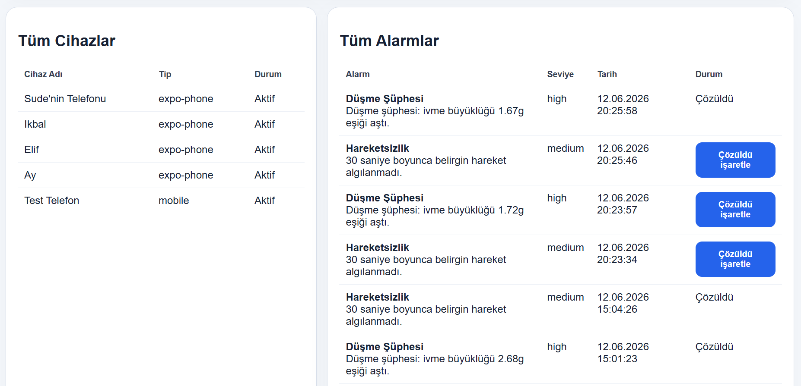
</p>

### Admin Veri Ekranı

<p align="center">
  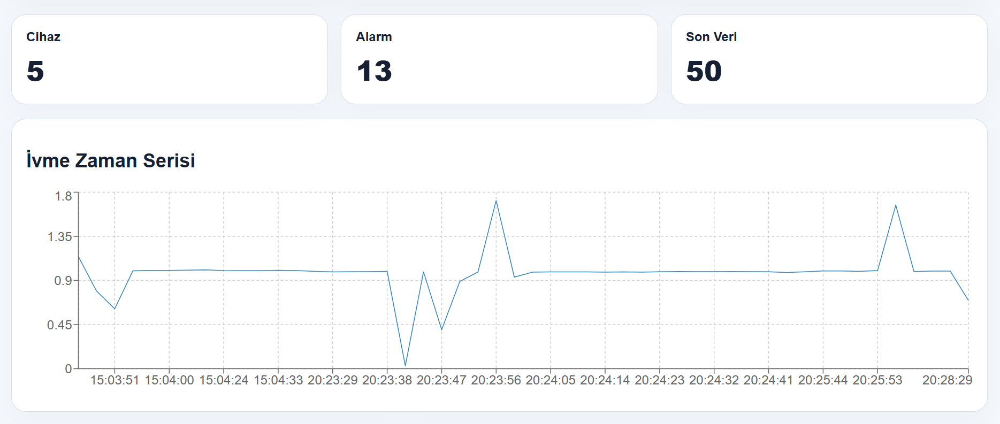
</p>


## Kurulum ve Çalıştırma
 
### Ön Gereksinimler
 
- Node.js v18+ ve npm v9+
- PostgreSQL erişimi (yerel kurulum veya [Neon](https://neon.tech) hesabı)
- Mobil cihazda **Expo Go** uygulaması (Android / iOS)
### 1. Veritabanı
 
```sql
-- Sıfırdan kurulum: schema.sql dosyasını PostgreSQL'de çalıştırın
\i database/schema.sql
 
-- Mevcut (veri içeren) veritabanı için bir kez:
\i database/migration_timestamptz.sql
```
 
### 2. Backend
 
```bash
cd backend
npm install
cp .env.example .env   # değerleri kendi ortamınıza göre doldurun
npm run dev            # geliştirme (nodemon) — veya: npm start
```
 
`.env` değişkenleri:
 
| Değişken | Açıklama | Varsayılan |
|---|---|---|
| `PORT` | Sunucu portu | `5000` |
| `DATABASE_URL` | PostgreSQL bağlantı dizesi | — |
| `JWT_SECRET` | Access token imza anahtarı | — |
| `JWT_REFRESH_SECRET` | Refresh token imza anahtarı | — |
| `DB_SSL` | SSL kullanımı (`false` ile kapatılır) | `true` |
| `FALL_THRESHOLD` | Düşme eşiği (g) | `1.6` |
| `INACTIVITY_SECONDS` | Hareketsizlik kontrol penceresi (sn) | `30` |
| `MOVEMENT_EPSILON` | Hareketsizlik için min-max fark eşiği (g) | `0.08` |
| `INACTIVITY_COOLDOWN_SECONDS` | Hareketsizlik alarmı tekrar bekleme süresi (sn) | `120` |
 
### 3. İlk Admin Kullanıcısı
 
`/api/admin/create-admin` ucu admin yetkisi gerektirdiğinden, ilk admin elle yetkilendirilir:
 
```sql
-- Önce normal kayıt akışıyla bir kullanıcı oluşturun, sonra:
UPDATE users SET role = 'admin' WHERE email = 'admin@ornek.com';
```
 
Sonraki adminler web paneli üzerinden bu hesapla eklenebilir.
 
### 4. Mobil Uygulama
 
```bash
cd mobile
npm install
npx expo start
```
 
Telefon ile bilgisayar **aynı Wi-Fi ağında** olmalıdır. Expo Go ile QR kodu taratın; API adresi `Constants.expoConfig.hostUri` üzerinden otomatik ayarlanır.
 
### 5. Web Paneli
 
```bash
cd web-panel
npm install
npm run dev
```
 
Panel `http://localhost:5173` adresinde açılır. API adresi `VITE_API_ORIGIN` ortam değişkeniyle özelleştirilebilir; verilmezse `http://<hostname>:5000` kullanılır.
 
## API Uç Noktaları
 
| Metod | Uç Nokta | Yetki | Açıklama |
|---|---|---|---|
| POST | `/api/auth/register` | Herkese açık | Yeni kullanıcı kaydı (rol her zaman `user`) |
| POST | `/api/auth/login` | Herkese açık | Giriş; accessToken + refreshToken döner |
| POST | `/api/auth/refresh` | Herkese açık | Refresh token ile yeni access token |
| GET | `/api/devices` | JWT | Cihazları listeler (admin: tümü) |
| POST | `/api/devices` | JWT | Yeni cihaz kaydeder |
| PATCH | `/api/devices/:id/status` | JWT | Cihazı aktif/pasif yapar |
| POST | `/api/sensor-data` | JWT | Sensör kaydı oluşturur + anomali analizi çalıştırır |
| GET | `/api/sensor-data` | JWT | Sensör verilerini listeler (`?limit=N`, maks 500) |
| GET | `/api/sensor-data/latest` | JWT | Her cihaz için en son kaydı döner |
| GET | `/api/alerts` | JWT | Alarm kayıtlarını listeler (admin: tümü) |
| PATCH | `/api/alerts/:id/resolve` | JWT | Alarmı çözümlendi olarak işaretler |
| POST | `/api/admin/create-admin` | JWT (admin) | Yeni admin oluşturur |
| GET | `/api/health` | Herkese açık | Sağlık kontrolü |
 
**Örnek istek — `POST /api/sensor-data`:**
 
```json
{
  "deviceId": "550e8400-e29b-41d4-a716-446655440000",
  "accelerometer": { "x": 0.12, "y": 0.08, "z": 0.99 },
  "gyroscope": { "x": 0.01, "y": -0.02, "z": 0.00 },
  "location": { "latitude": 40.183, "longitude": 29.067 },
  "accelerationMagnitude": 1.003,
  "recordedAt": "2026-06-11T20:03:00.000Z"
}
```
 
## Gerçek Zamanlı Olaylar (Socket.io)
 
Bağlantı JWT ile doğrulanır: `io(API_ORIGIN, { auth: { token } })`. Her kullanıcı `user:<id>` odasına, adminler ayrıca `admins` odasına alınır.
 
| Olay | Yön | Açıklama |
|---|---|---|
| `sensor:new` | sunucu → istemci | Yeni sensör kaydı (yalnızca veri sahibi + adminler) |
| `alert:new` | sunucu → istemci | Yeni alarm kaydı (yalnızca veri sahibi + adminler) |
 
## Anomali Tespiti
 
- **Düşme şüphesi (eşik tabanlı):** Anlık ivme büyüklüğü √(x²+y²+z²) ≥ `FALL_THRESHOLD` ise `fall_suspected` / `high` alarmı üretilir.
- **Hareketsizlik (zaman serisi):** Son `INACTIVITY_SECONDS` saniyedeki kayıtlarda (en az 3 kayıt) max−min farkı `MOVEMENT_EPSILON` altındaysa `inactivity` / `medium` alarmı üretilir; aynı cihaz için `INACTIVITY_COOLDOWN_SECONDS` içinde tekrar alarm üretilmez.
 
## Gizlilik ve Güvenlik Notları
 
- Konum izni yalnızca kullanıcı onayıyla (foreground) alınır; yalnızca gerekli sensör verileri toplanır.
- Şifreler bcrypt ile hashlenir; ham şifre hiçbir zaman saklanmaz. Token'lar mobilde SecureStore'da tutulur.
- Kayıt ucundan gelen `role` alanı yok sayılır; herkes `user` olarak kaydolur. Admin oluşturma rol middleware'i ile korunur.
- Socket.io yayınları oda bazlıdır; bir kullanıcının verisi başka kullanıcılara asla yayınlanmaz.
## Bilinen Kısıtlar
 
- Expo Go arka planda sensör toplamayı kısıtlar; uygulama arka plana alındığında gönderim durur.
- GPS konumu yalnızca uygulama açılışında bir kez alınır.
- Hareketsizlik tespiti için en az 3 kayıt gerektiğinden ilk ~30 saniyede tespit yapılamaz.
- Web paneli token'ı localStorage'da saklar; üretim ortamında httpOnly cookie tercih edilmelidir.
## Ekip
 
| Üye | Sorumluluk |
|---|---|
| Erva Nur Bostancı | Veritabanı + Backend (şema tasarımı, sensör modülü, anomali servisi) |
| Zeynep Kaya | Backend (Express iskeleti, JWT kimlik doğrulama, middleware'ler, Socket.io) |
| Aynur Adıbelli | Mobil + Web Paneli (Expo uygulaması, izleme paneli, arayüz tasarımı) |
 
Gereksinim analizi, testler ve dokümantasyon ekip tarafından ortak yürütülmüştür.
 
## Lisans
 
Bu proje, Bursa Teknik Üniversitesi Node.js ile Web Programlama dersi dönem projesi kapsamında eğitim amaçlı geliştirilmiştir.
